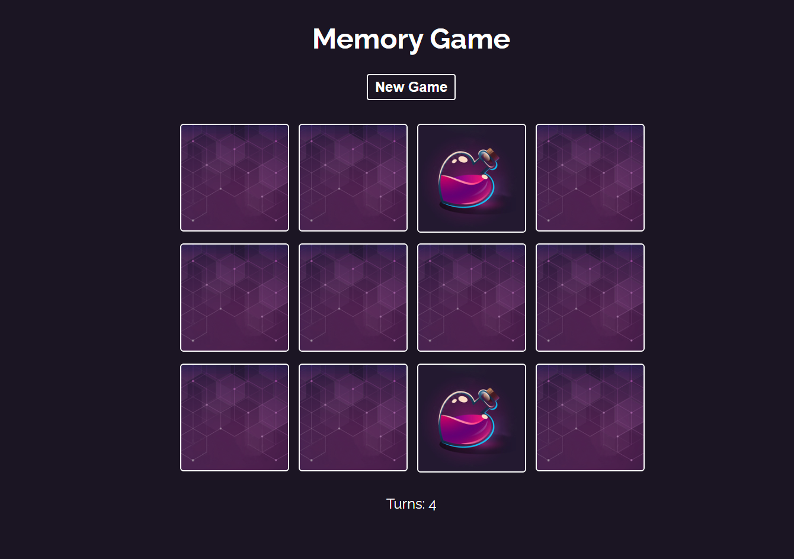

# 🧠 Memory Game - React App

This is a **Memory Game** built using React. The game consists of multiple cards that are initially face down. The player clicks on two cards to flip them over. If the two cards match, they stay face up. If not, they are flipped back over.

## 🎮 How to Play
1. Click on two cards to reveal their images.
2. If the cards match, they remain flipped.
3. If the cards do not match, they will flip back over after a short delay.
4. The game ends when all pairs of cards are matched.
5. Test your memory and try to complete the game in the fewest moves possible!

## ✨ Features
- Fun and engaging gameplay to test your memory
- Smooth animations for card flips
- Tracks number of moves
- Restart the game at any time
- Responsive design for mobile and desktop devices

## 🛠️ Technologies Used
- React (JavaScript library for building UI)
- CSS for styling and animations
- React Hooks for managing game state

## 🚀 How to Run the Project

To run this project locally, follow these steps:

1. Clone the repository:
    ```bash
    git clone https://github.com/YourUsername/memory-game-react.git
    ```

2. Navigate into the project directory:
    ```bash
    cd memory-game-react
    ```

3. Install the required dependencies:
    ```bash
    npm install
    ```

4. Start the development server:
    ```bash
    npm start
    ```

5. Open your browser and go to `http://localhost:3000` to play the game.

## 🖼️ Game Preview

Here’s a preview of the Memory Game:



## 🔧 Customization

You can easily customize the game by adding your own images for the cards. Just replace the images in the `src/assets` folder with your own images and the game will automatically update.

## 📊 Score Tracking
- The game tracks the number of moves you make.
- Try to complete the game with the fewest moves to achieve the highest score.

## License
This project is licensed under the MIT License - see the [LICENSE](LICENSE) file for details.
